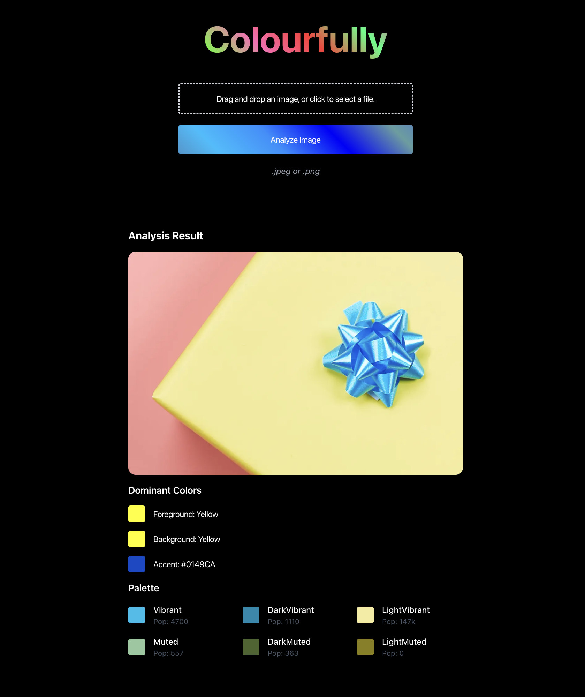

# 🌈 Colourfully

## 🚀 Description

**Colourfully** is a web application that allows users to upload an image and receive a detailed breakdown of its color palette. From dominant colors to nuanced palettes, Colourfully provides insights for designers, developers, and anyone passionate about colors.

🔗 **Live Demo**: [https://colourfully.vercel.app/](https://colourfully.vercel.app/)

---

## 🛠️ Technologies Used

- **Frontend**: React, Next.js, TypeScript
- **Backend**: Cloudinary, Microsoft Image Analysis API, Node Vibrant
- **Authentication**: Clerk
- **Deployment**: Vercel
- **Development Tools**: VS Code, Canva, remove.bg, favicon.io

---

## 📚 Things I Learned

While building Colourfully, I gained valuable experience in the following areas:

- **Working with APIs**: Integrating Cloudinary and Microsoft Image Analysis API taught me how to handle third-party services effectively.
- **Image Processing**: Learned how to extract and analyse colour palettes using tools like Node Vibrant.
- **Authentication**: Implemented secure and user-friendly authentication flows with Clerk.
- **Frontend Development**: Improved my skills in building responsive and accessible UIs using Next.js and React.
- **Deployment**: Gained hands-on experience deploying and optimising a project on Vercel.
- **UI/UX Design**: Enhanced my understanding of creating visually appealing and user-friendly interfaces.

## 🙌 Acknowledgements

Special thanks to the following services and communities for making this project possible:

- **Microsoft**: Image Analysis API for advanced image processing
- **Cloudinary**: Robust image hosting and processing
- **Clerk**: Seamless authentication services
- **Node Vibrant**: Detailed color extraction algorithms
- **Vercel**: Hosting and deployment infrastructure
- **Open Source**: Next.js, React, and TypeScript communities
- **Shadcn/ui & Aceternity**: Beautiful UI components

---

## 🌟 Future Considerations

### Scaling
- Optimise image processing for larger files and higher traffic
- Implement caching strategies to reduce API calls
- Add database storage for user history and preferences
- Explore serverless functions for better resource allocation

### Feature Enhancements
- Export options (Adobe, Figma, CSS variables)
- Color accessibility scoring
- Shareable palettes with unique URLs
- Color naming with industry standards (Pantone, RAL)
- Browser extensions for capturing colors from any website
- Mobile applications for on-the-go color capturing

---

## 📸 Screenshots

---

## 🧑‍💻 About Me

Hi, I'm Tristan! I'm a passionate developer with a focus on building intuitive and visually appealing web applications. Colourfully is a project that showcases my skills in full-stack development, UI/UX design, and working with APIs.

🔗 **Portfolio**: [https://tjmb.dev](https://tjmb.dev)  

---